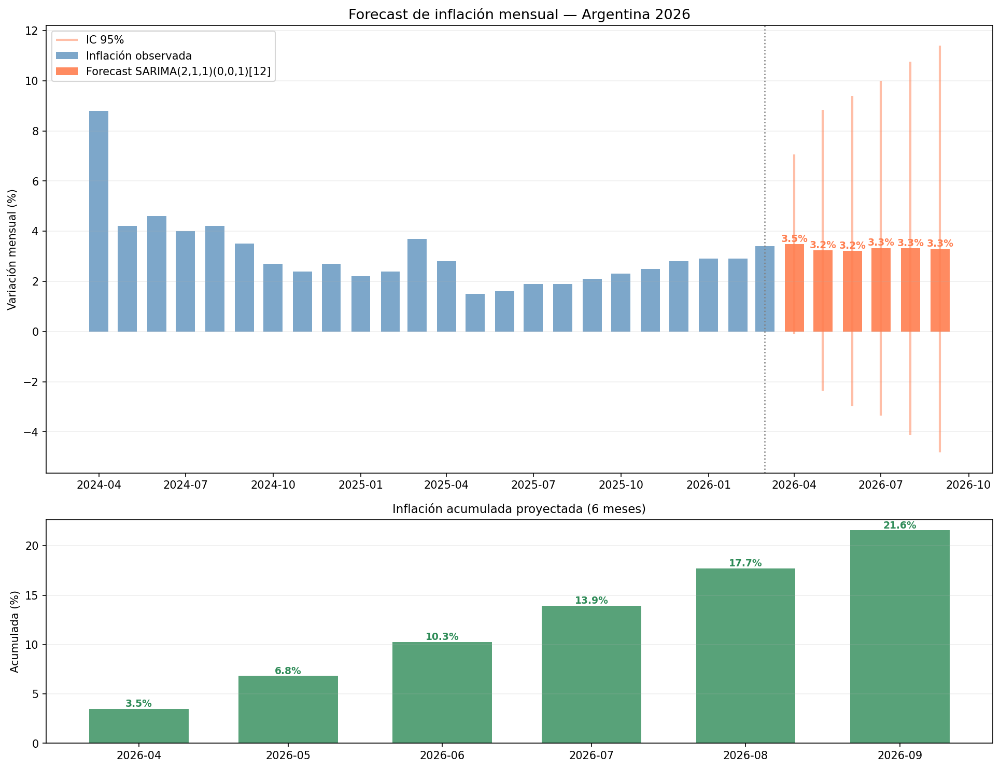

# Predicción de Inflación en Argentina — Modelo SARIMA


---

## ¿De qué trata este proyecto?

Argentina tiene uno de los procesos inflacionarios más complejos del mundo. Este proyecto analiza la evolución del Índice de Precios al Consumidor (IPC) a nivel nacional desde diciembre de 2016 hasta marzo de 2026, y construye un modelo estadístico para proyectar la inflación mensual de los próximos 6 meses.

Los datos provienen del **INDEC** (Instituto Nacional de Estadística y Censos) y corresponden al Nivel General del IPC para la región Nacional.

---

## Visualización del forecast



---

## ¿Qué se hizo?

1. **Limpieza y preparación de datos** — Se hizo limpieza de el CSV del INDEC ya que viene con separadores decimales en coma y múltiples regiones, así que se filtró y procesó para trabajar con la serie nacional mensual unicamente.

2. **Análisis exploratorio** — se graficó la inflación mensual y anual acumulada, descomponiendo la serie en tendencia, estacionalidad y residuo.

3. **Test de estacionariedad** — se aplicó el test de Dickey-Fuller aumentado (ADF), que confirmó que la serie no es estacionaria, algo esperable en una economía con inflación estructural como la argentina.

4. **Selección del modelo** — se compararon varios modelos SARIMA usando los criterios AIC (Akaike) y BIC (Bayesian). El mejor modelo fue el **SARIMA(2,1,1)(0,0,1)[12]**, que captura tanto la dinámica de corto plazo como el patrón estacional anual.

5. **Forecast** — se proyectaron 6 meses hacia adelante con intervalo de confianza del 95%, y se calculó la inflación acumulada proyectada.

---

## Conclusiones

- La serie muestra una tendencia creciente muy marcada, con un pico histórico en 2024 producto de la aceleración inflacionaria durante el proceso de estabilización.
- El modelo detecta inercia inflacionaria de dos meses (ar.L1 y ar.L2 significativos), consistente con la indexación de contratos y expectativas en Argentina.
- El forecast proyecta una inflación mensual en desaceleración gradual, aunque con alta incertidumbre dado el contexto macroeconómico y politico argentino.

---

## Estructura del proyecto

```
📂 Inflacion Argentina
├── inflacion_argentina.ipynb   # Notebook principal
├── ipc.csv                     # Datos INDEC
├── forecast_inflacion.png      # Gráfico de forecast
└── README.md
```

---


## Fuente de datos

- **INDEC** — Índice de Precios al Consumidor (IPC), Nivel General, región Nacional.
- Período: diciembre 2016 — marzo 2026.

---
